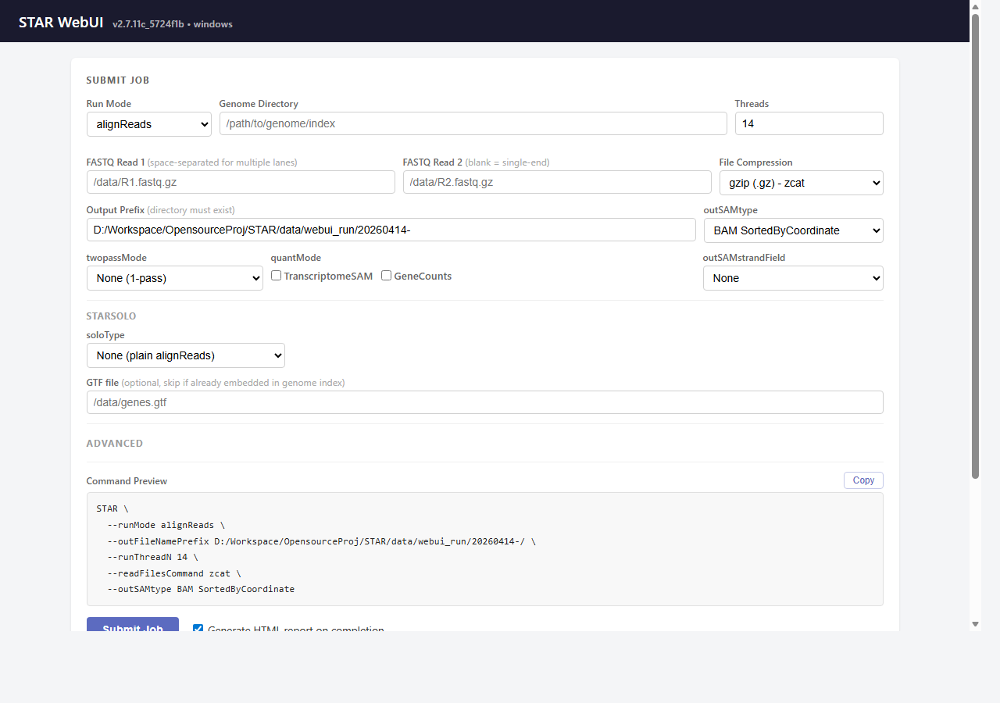
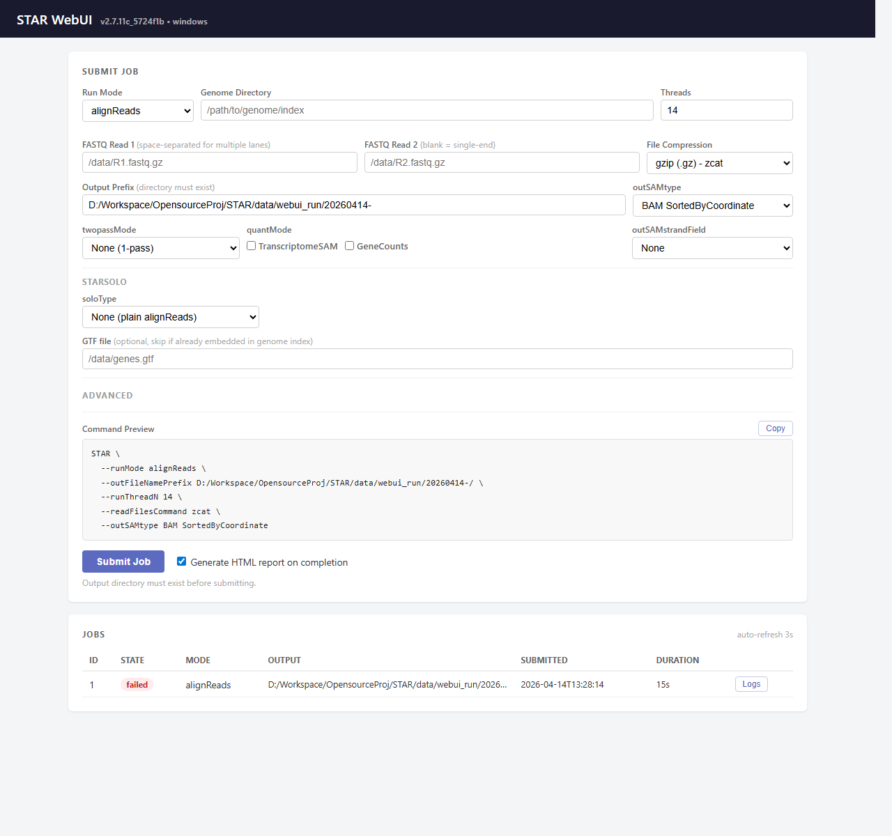

STAR 2.7.11c (Community Fork)
==========
Spliced Transcripts Alignment to a Reference
© Alexander Dobin, 2009-2024
https://www.ncbi.nlm.nih.gov/pubmed/23104886

> **Fork Notice:** The upstream STAR repository (`alexdobin/STAR`) appears to be unmaintained as of 2025
> (see [community discussion](https://www.reddit.com/r/bioinformatics/comments/1joyd0p/the_star_aligner_is_unmaintained_now/)).
> This fork maintains full output compatibility with STAR 2.7.11b while adding **Windows native support**,
> **macOS ARM (Apple Silicon) support**, and upstream bug fixes.
> All changes are validated to produce byte-identical results to the original 2.7.11b release.
> Release binaries are versioned as `2.7.11c_<commit>` for traceability.

ORIGINAL AUTHOR
===============
Alex Dobin, dobin@cshl.edu </br>
https://github.com/alexdobin/STAR/issues </br>
https://groups.google.com/d/forum/rna-star

FORK MAINTAINER
===============
birdingman0626 </br>
https://github.com/birdingman0626/STAR/issues

HARDWARE/SOFTWARE REQUIREMENTS
==============================
  * x86-64 compatible processors
  * 64 bit Linux, Mac OS X, or Windows

MANUAL
======
https://github.com/alexdobin/STAR/blob/master/doc/STARmanual.pdf

[RELEASEnotes](https://github.com/alexdobin/STAR/blob/master/RELEASEnotes.md) contains detailed information about the latest major release
[CHANGES](https://github.com/alexdobin/STAR/blob/master/CHANGES.md) contains detailed information about all the changes in all releases

DIRECTORY CONTENTS
==================
  * source: all source files required for compilation
  * bin: pre-compiled executables for Linux and Mac OS X
  * doc: documentation
  * extras: miscellaneous files and scripts
  * docs/webui: screenshots and Web UI documentation

WEB UI
======

STAR ships with a built-in browser interface for submitting and monitoring alignment jobs without using the command line. Start it with:

```bash
STAR.exe --runMode webui --webuiPort 8080 --outFileNamePrefix /path/to/output/
```

Then open `http://127.0.0.1:8080` in your browser.

**Job submission form** — configure genome directory, FASTQ input files, STARsolo cell chemistry, quantification mode, and output settings. A live command preview shows the exact STAR command that will run.



**Job queue** — lists submitted jobs with state (queued / running / succeeded / failed / cancelled), output directory, timestamps, and duration. Log and report links appear when a job completes.



**Features:**
  * Supports `alignReads`, `genomeGenerate`, and `soloCellFiltering` run modes
  * STARsolo chemistry presets (10x v2/v3, Drop-seq, SHARE-seq, custom)
  * Live command preview before submission
  * Tooltips on every parameter
  * Auto-detects STAR genome indexes and CellRanger reference directories
  * Generates an HTML QC report on job completion (opt-in, on by default)
  * Defaults thread count to the number of logical CPU cores on the server machine
  * Binds to `127.0.0.1` only (local use); change with `--webuiHost`

**Web UI options:**

| Option | Default | Description |
|--------|---------|-------------|
| `--webuiPort` | `8080` | TCP port to listen on |
| `--webuiHost` | `127.0.0.1` | Bind address |
| `--outFileNamePrefix` | (required) | Default output directory prefix shown in the form |

COMPILING FROM SOURCE
=====================

Download the latest [release from](https://github.com/alexdobin/STAR/releases) and uncompress it
--------------------------------------------------------

```bash
# Get latest STAR source from releases
wget https://github.com/alexdobin/STAR/archive/2.7.11b.tar.gz
tar -xzf 2.7.11b.tar.gz
cd STAR-2.7.11b

# Alternatively, get STAR source using git
git clone https://github.com/alexdobin/STAR.git
```

Compile under Linux (Make)
--------------------------

```bash
# Compile
cd STAR/source
make STAR
```
For processors that do not support AVX extensions, specify the target SIMD architecture, e.g.
```
make STAR CXXFLAGS_SIMD=sse
```

Compile under Linux (CMake - new)
---------------------------------

```bash
cd STAR/source
cmake -B build -DCMAKE_BUILD_TYPE=Release
cmake --build build -j$(nproc)
```
Compile under Mac OS X (Intel x86_64)
--------------------------------------

```bash
# 1. Install brew (http://brew.sh/)
# 2. Install gcc with brew:
$ brew install gcc ninja
# 3. Find installed g++ version (e.g. g++-15)
$ GCC_BIN=$(ls $(brew --prefix gcc)/bin/g++-* | sort -V | tail -1)
$ GCC_VER=$(basename "$GCC_BIN" | grep -oE '[0-9]+$')
# 4. Build with CMake (must specify both C and CXX to get OpenMP)
$ cd STAR/source
$ cmake -B build -G Ninja \
    -DCMAKE_BUILD_TYPE=Release \
    -DCMAKE_C_COMPILER=$(brew --prefix gcc)/bin/gcc-${GCC_VER} \
    -DCMAKE_CXX_COMPILER=${GCC_BIN}
$ cmake --build build
```

Compile under macOS ARM (Apple Silicon / M-series)
---------------------------------------------------

Same as above. AVX2 is automatically disabled on ARM; the build uses the bundled SIMDe library for SIMD emulation.

```bash
$ brew install gcc ninja
$ GCC_BIN=$(ls $(brew --prefix gcc)/bin/g++-* | sort -V | tail -1)
$ GCC_VER=$(basename "$GCC_BIN" | grep -oE '[0-9]+$')
$ cd STAR/source
$ cmake -B build -G Ninja \
    -DCMAKE_BUILD_TYPE=Release \
    -DCMAKE_C_COMPILER=$(brew --prefix gcc)/bin/gcc-${GCC_VER} \
    -DCMAKE_CXX_COMPILER=${GCC_BIN}
$ cmake --build build
```

Compile under Windows (MSVC)
----------------------------

STAR can be built natively on Windows using Microsoft Visual C++ and CMake.
Ninja is the recommended generator — it parallelizes compilation and is faster than NMake.

```bash
# 1. Open "x64 Native Tools Command Prompt for VS 2022"
# 2. Navigate to STAR source directory
cd STAR\source

# 3. Configure and build with CMake + Ninja (zlib is fetched automatically)
cmake -B build -G Ninja -DCMAKE_BUILD_TYPE=Release
cmake --build build

# 4. The resulting STAR.exe is in build\
build\STAR.exe --version
```

Build options:
```bash
# Build STARlong variant for long reads
cmake -B build -G Ninja -DCMAKE_BUILD_TYPE=Release -DSTAR_LONG_READS=ON

# Disable AVX2 (for older or ARM processors)
cmake -B build -G Ninja -DCMAKE_BUILD_TYPE=Release -DSTAR_USE_AVX2=OFF

# Enable AddressSanitizer for debugging
cmake -B build -G Ninja -DCMAKE_BUILD_TYPE=Debug -DSTAR_ASAN=ON
```

Compile under Windows (Intel oneAPI ICX)
-----------------------------------------

Intel ICX provides OpenMP 5.1 (vs MSVC's 2.0) but benchmarks show similar throughput
since STAR's bottleneck is memory-latent suffix array search.

```bash
# 1. Open "Intel oneAPI Command Prompt for Intel 64 for Visual Studio 2022"
# 2. Navigate to STAR source directory
cd STAR\source
cmake -B build-icx -G Ninja -DCMAKE_BUILD_TYPE=Release -DCMAKE_CXX_COMPILER=icx -DCMAKE_C_COMPILER=icx
cmake --build build-icx
```

**Benchmarked performance** (STARsolo CB_UMI_Simple, cynomolgus macaque genome, Intel Core Ultra 5 235, 96GB DDR5, 12 threads, Windows 11):

| Build | Speed (434M reads) | Speed (1M reads) | Notes |
|-------|:---:|:---:|-------|
| Upstream STAR 2.7.11b (Linux GCC) | — | 277 M/hr | Baseline |
| STAR 2.7.11c MSVC (pre-optimization) | 518 M/hr | 277 M/hr | Windows perf fixes only |
| **STAR 2.7.11c MSVC (current)** | — | **300 M/hr (+8%)** | + FastResetVector, safe early rejection |
| Intel ICX `/O2` | 500 M/hr | — | No measurable benefit over MSVC |

The 8% mapping speed gain comes from two output-identical algorithmic optimizations:
  * **FastResetVector**: O(modified) reset of the 200KB `winBin` array instead of O(N) memset per read
  * **Safe early rejection**: skip expensive `Transcript` copy in `stitchWindowAligns` when `stitchAlignToTranscript` would provably reject the alignment (full read/genome overlap or max exons exceeded)

**Output compatibility** (`my_count` vs `orig_count`, validated on 434M-read STARsolo dataset):

`orig_count` is the Linux upstream STAR 2.7.11b (GCC) reference output. `my_count` is this fork (STAR 2.7.11c, MSVC, Windows). The 21-file Solo.out comparison covers both Gene and GeneFull_Ex50pAS quantification modes. Windows STAR writes `\r\n` line endings; comparison is content-only.

| Output file | my_count vs orig_count |
|-------------|:----------------------:|
| `Gene/filtered/barcodes.tsv` | Identical |
| `Gene/filtered/features.tsv` | Identical |
| `Gene/filtered/matrix.mtx` | 18/6.3M entries differ (<3 ppm) |
| `Gene/raw/barcodes.tsv` | Identical |
| `Gene/raw/features.tsv` | Identical |
| `Gene/raw/matrix.mtx` | 21/8.7M entries differ (<3 ppm) |
| `Gene/raw/UniqueAndMult-EM.mtx` | 38/9.97M entries differ (<4 ppm) |
| `Gene/Summary.csv` | 3/20 values differ (tens of reads) |
| `Gene/Features.stats` | 7/11 values differ (tens of reads) |
| `Gene/UMIperCellSorted.txt` | 22/770K cells differ by ±1 UMI |
| `GeneFull_Ex50pAS/filtered/barcodes.tsv` | Identical |
| `GeneFull_Ex50pAS/filtered/features.tsv` | Identical |
| `GeneFull_Ex50pAS/filtered/matrix.mtx` | 32/8.8M entries differ (<4 ppm) |
| `GeneFull_Ex50pAS/raw/barcodes.tsv` | Identical |
| `GeneFull_Ex50pAS/raw/features.tsv` | Identical |
| `GeneFull_Ex50pAS/raw/matrix.mtx` | 53/12M entries differ (<5 ppm) |
| `GeneFull_Ex50pAS/raw/UniqueAndMult-EM.mtx` | ~91/13.87M entries differ (<7 ppm) |
| `GeneFull_Ex50pAS/Summary.csv` | 3/20 values differ (tens of reads) |
| `GeneFull_Ex50pAS/Features.stats` | 7/11 values differ (tens of reads) |
| `GeneFull_Ex50pAS/UMIperCellSorted.txt` | 54/837K cells differ by ±1 UMI |
| `Barcodes.stats` | Identical |

The small count differences (1–5 ppm) are caused by the chimeric bugfix (ggpeti/STAR cherry-pick) reclassifying a handful of reads at chimeric junctions — reads that were previously mis-scored by the upstream code. The EM files additionally contain last-decimal-place float differences from MSVC vs GCC floating-point codegen. Cell barcodes, features, filtered cell sets, and overall mapping statistics are unaffected.

**Windows limitations:**
  * Shared memory genome loading (`--genomeLoad LoadAndKeep/Remove`) is not supported; only `--genomeLoad NoSharedMemory` (the default) is available
  * `--readFilesCommand` uses temporary files instead of FIFO pipes

All platforms - non-standard gcc
--------------------------------

If g++ compiler (true g++, not Clang sym-link) is not on the path, you will need to tell `make` where to find it:
```bash
cd source
make STARforMacStatic CXX=/path/to/gcc
```

If employing STAR only on a single machine or a homogeneously setup cluster, you may aim at helping the compiler to optimize in way that is tailored to your platform. The flags LDFLAGSextra and CXXFLAGSextra are appended to the default optimizations specified in source/Makefile.
```
# platform-specific optimization for gcc/g++
make CXXFLAGSextra=-march=native
# together with link-time optimization
make LDFLAGSextra=-flto CXXFLAGSextra="-flto -march=native"
```

FreeBSD ports
=============

STAR can be installed on FreeBSD via the FreeBSD ports system.
To install via the binary package, simply run:
```
pkg install star
```

LIMITATIONS
===========
This release was tested with the default parameters for human and mouse genomes.
Mammal genomes require at least 16GB of RAM, ideally 32GB.
Please contact the author for a list of recommended parameters for much larger or much smaller genomes.

FORK CHANGES
============

### Windows Native Support (new)
  * CMake build system (`source/CMakeLists.txt`) supporting MSVC, GCC, and Clang
  * Windows compatibility layer (`source/wincompat.h`) providing POSIX API shims
  * `FixedStreamBuf.h`: cross-platform replacement for `pubsetbuf` (no-op on MSVC)
  * Automatic zlib download via CMake FetchContent when system zlib is unavailable
  * All VLAs replaced with `std::vector` for C++ standard compliance
  * Missing `#include <numeric>` added for MSVC compatibility
  * Missing mutex initializations fixed (portability bug in upstream)
  * OpenMP loop variables changed to signed types (MSVC OpenMP 2.0 compliance)

### Web UI (new)
  * Built-in HTTP server (`--runMode webui`) for job submission and monitoring
  * Browser-based form for `alignReads`, `genomeGenerate`, and `soloCellFiltering`
  * STARsolo chemistry presets (10x v2/v3, Drop-seq, SHARE-seq, custom) and live command preview
  * Job queue with state tracking, log tailing, and HTML QC report generation
  * STARsolo artifact discovery: `GET /jobs/:id/artifacts` lists `Solo.out/`, BAM, SAM, `SJ.out.tab`
  * `GET /metrics` Prometheus-format job counters and server uptime (enabled via `--webuiMetrics`)
  * Path traversal protection rejects `..` components in all submitted paths
  * Bounded queue: at most 1 running + 9 queued jobs; returns HTTP 429 when full
  * Crash recovery: terminal job states persisted to `.webui_jobs.jsonl`; restored on server restart
  * Tooltips on every parameter, auto-detect STAR genome indexes and CellRanger references
  * Pure C++ implementation using cpp-httplib + nlohmann/json; no Node.js required
  * Child-process execution model keeps the server stable across run failures

### Performance Optimizations
  * MSVC compiler: `/O2 /Ob2 /Oi /GL` with `/LTCG` link-time optimization (Windows)
  * SRW locks replacing CRITICAL_SECTION (faster mutex, Windows)
  * 4MB ifstream read buffer for FASTQ input (Windows)
  * Zero-allocation read header parsing (direct `char*` instead of `istringstream`, Windows)
  * FastResetVector for `winBin` array: O(modified) reset instead of O(200K) memset per read (all platforms)
  * Safe early rejection in `stitchWindowAligns`: skip Transcript copy when alignment provably fails (all platforms)
  * Union-Find for UMI connected components: replaces recursive DFS, eliminates stack overflow risk (all platforms)
  * EmptyDrops binary search: O(cand × log(nSim)) p-value counting instead of O(cand × nSim) (all platforms)
  * EmptyDrops on-demand memory: O(nSim × nUniqueCounts) instead of O(nSim × maxCount) (all platforms)

### Bug Fixes (applicable to all platforms)
  * Initialize all `pthread_mutex_t` members in `ThreadControl` (upstream only initialized 8 of 11)
  * Fix `stitchAlignToTranscript` declaration/definition `const` mismatch
  * Chimeric alignment fixes (cherry-picked from ggPeti/STAR `feat/chimScoreUsePostStitch`):
    - Block-based chimeric overlap replaces scalar single-interval check for multi-exon layouts
    - Better exon-pair selection for chimeric junctions (overlapping cross-reference exon, not just first/last)
    - Trim stitched transcripts to the junction-relevant side before rescoring
    - Fix cross-mate `roStart` computation (`a2.Lread` instead of `a1.Lread` on negative strand)

### Project Quality
  * C++17 standard (upgraded from C++11)
  * GitHub Actions CI (Linux GCC/Clang, macOS, Windows MSVC)
  * Dockerfile for reproducible builds
  * `.clang-tidy`, `.clang-format`, `.editorconfig` configs
  * doctest unit tests: `PackedArray`, `binarySearch2`, `FastResetVector`, UMI graph connected-components and directed-collapse, `blocksOverlap`, EmptyDrops p-value counting, barcode/UMI parsing
  * CTest integration with `STAR_BUILD_TESTS=ON` (default)
  * Differential validation harness (`scripts/validate_build.sh`): build + version + 1M-read smoke comparison
  * Makefile OBJECTS bug fix (7 entries had `.cpp` instead of `.o`)

### Dependency Upgrades
  * Bundled HTSlib upgraded from 1.3 (2016) to 1.21 (2024) with bundled htscodecs

### Evaluated and Rejected
  * **CUDA GPU acceleration**: Tested on RTX PRO 6000 Blackwell (96GB VRAM). STAR's bottleneck is memory-latent suffix array search, not parallelizable compute. GPU overhead exceeded the gains.
  * **Intel oneAPI/MKL/IPP**: STAR does no linear algebra or signal processing. The remaining 1.4x gap vs Linux is from MSVC's OpenMP 2.0 and code generation, not addressable by Intel libraries.
  * **Branch-and-bound pruning in alignment stitching**: Upper bound doesn't account for splice junction score bonuses, causing incorrect branch pruning that changed alignment results (~3% unique mapping shift). No measurable speed benefit over the safe early rejection approach.

FUNDING
=======
The development of STAR is supported by the National Human Genome Research Institute of
the National Institutes of Health under Award Number R01HG009318.
The content is solely the responsibility of the authors and does not necessarily represent the official views of the National Institutes of Health.
